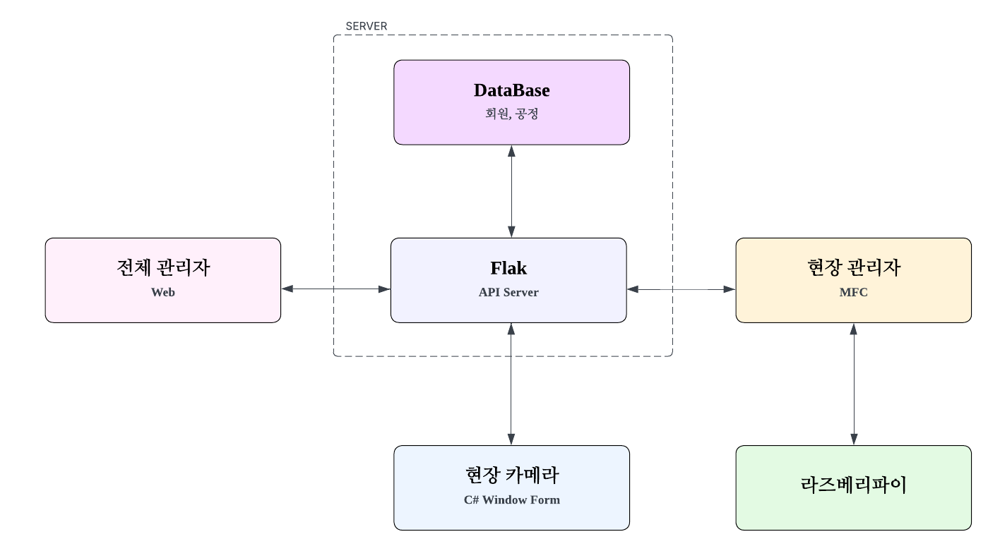

# 🏭 스마트 공장 모니터링 시스템

생산라인 불량 검출, 실시간 모니터링, 관리자 채팅, 하드웨어 제어를 통합한 스마트 공장 관리 시스템입니다.

---

## 📌 프로젝트 소개
본 프로젝트는 스마트 공장 환경을 가정하여, 생산라인 영상 기반 불량 검출과 실시간 모니터링, 관리자 간 채팅 기능을 통합한 시스템입니다.

Flask 서버를 중심으로 현장 관리자(MFC), 현장 카메라(WinForms), 전체 관리자(Web Dashboard)를 연결하고, YOLO 기반 객체 검출을 통해 생산라인의 불량 상태를 실시간으로 확인할 수 있도록 구성했습니다.

또한 Socket.IO 기반 실시간 채팅 기능을 통해 현장 관리자와 전체 관리자 간 즉각적인 커뮤니케이션이 가능하도록 설계했으며, Raspberry Pi, GPIO, RS232 통신을 활용해 외부 장비와의 연동 기능도 포함했습니다.

---

## 📅 프로젝트 정보
- 개발 기간: 2026.04.22 ~ 2026.05.04
- 개발 형태: 팀 프로젝트
- 개발 환경: Visual Studio, Visual Studio Code

---

## 🧩 시스템 구성
- Flask API Server
- 현장 관리자 프로그램 (MFC)
- 현장 카메라 프로그램 (C# WinForms)
- 전체 관리자 Web Dashboard
- YOLO 기반 불량 검출 모듈
- Raspberry Pi 기반 장비 제어 모듈
- Socket.IO 기반 실시간 채팅 모듈

---

## 🖥 시스템 구성도

---

## 🔄 시스템 흐름
1. 현장 카메라 프로그램에서 생산라인 영상 수집  
2. YOLO 기반 불량 검출 모듈에서 제품 상태 분석  
3. 검출 결과 및 상태 데이터를 Flask 서버로 전송  
4. 전체 관리자 Web Dashboard에서 생산라인 상태 모니터링  
5. 현장 관리자 프로그램(MFC)에서 설비 상태 및 현장 데이터 확인  
6. Socket.IO 기반 채팅으로 현장 관리자와 전체 관리자 간 실시간 메시지 송수신  
7. Raspberry Pi, GPIO, RS232 통신을 통해 외부 장비 상태 처리 및 제어  

---

## 🛠 기술 스택

| 구분 | 내용 |
|------|------|
| Backend | Python, Flask |
| Frontend | HTML, CSS, JavaScript |
| Desktop | MFC(C++), WinForms(C#) |
| AI / Vision | YOLO, OpenCV |
| Communication | Socket.IO, TCP/IP, RS232 |
| Database | MySQL |
| Hardware | Raspberry Pi, GPIO |
| IDE | Visual Studio, Visual Studio Code |

---

## 💡 주요 기능

### 🎥 생산라인 모니터링
- 현장 카메라 기반 생산라인 영상 출력
- Flask 서버를 통한 영상 및 상태 데이터 처리
- Web Dashboard 기반 실시간 생산 상태 확인
- 온도, 습도, 장비 상태 등 생산라인 데이터 모니터링

### 🤖 불량 검출 시스템
- YOLO 기반 제품 불량 객체 검출
- OpenCV 기반 영상 프레임 처리
- 불량 위치 및 검출 신뢰도 표시
- 검출 결과를 서버 및 관리자 화면과 연동

### 💬 실시간 채팅 기능
- Socket.IO 기반 관리자 간 실시간 채팅
- 현장 관리자와 전체 관리자 간 메시지 송수신
- 내부 직원 간 커뮤니케이션 기능 제공
- 파일 및 메시지 전송 기능 구현

### 🖥 현장 관리자 시스템
- MFC 기반 현장 관리자 프로그램 구현
- 생산라인 상태 및 설비 데이터 확인
- 불량 검출 결과와 현장 상태 정보 확인
- 서버와의 통신을 통한 데이터 송수신 처리

### 🌐 전체 관리자 Web Dashboard
- 웹 기반 전체 생산라인 상태 확인
- 불량 검출 결과 및 모니터링 데이터 표시
- 관리자용 화면 구성 및 실시간 상태 갱신
- 채팅, 모니터링, 불량 확인 기능 제공

### ⚙ Raspberry Pi 연동
- Raspberry Pi 기반 생산라인 장비 제어
- GPIO 신호 기반 장비 상태 처리
- RS232 통신 기반 외부 장비 연동
- 생산라인 상태 데이터 실시간 처리

---

## 👨‍💻 구현 내용
- Python Flask 기반 API Server 구축
- HTML, CSS, JavaScript 기반 Web Dashboard 화면 구현
- MFC 기반 현장 관리자 프로그램 구현
- C# WinForms 기반 현장 카메라 프로그램 구현
- YOLO 및 OpenCV 기반 실시간 불량 검출 기능 구현
- Socket.IO 기반 실시간 채팅 기능 구현
- TCP/IP 및 RS232 기반 통신 처리
- Raspberry Pi 및 GPIO 기반 장비 제어 기능 구현
- MySQL 기반 생산라인 및 사용자 데이터 관리

---

## 🚀 프로젝트 특징
- AI 기반 불량 검출, 실시간 모니터링, 채팅 기능을 하나의 시스템으로 통합
- Flask 서버 중심의 다중 클라이언트 구조 설계
- Web, MFC, WinForms를 역할별로 분리한 시스템 구성
- Socket.IO를 활용한 관리자 간 실시간 커뮤니케이션 구현
- Raspberry Pi, GPIO, RS232를 활용한 하드웨어 연동 기능 포함

---

## 🎥 시연 영상
[시연 영상 보기](여기에_영상링크_넣기)

---

## 📑 발표 자료
- [발표자료 보기](docs/smart_factory_monitoring_presentation.pdf)

---

## 📷 실행 화면

### 🖥 시스템 모니터링

---

### 🤖 YOLO 불량 검출

---

### 🖥 현장 관리자 시스템 (MFC)

---

### 💬 실시간 채팅

